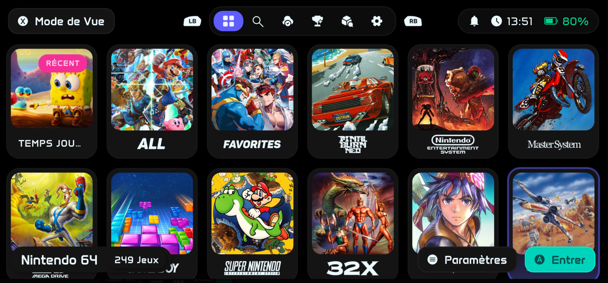

<div align="center">

# NeoStation iOS

#### Emulation frontend for iPhone and iPad

[](LICENSE.md)
[](https://github.com/TarbleFR/neostation-ios)



</div>

**NeoStation iOS** is an independently maintained iOS/iPadOS fork of
[NeoStation](https://github.com/misobadev/neostation-frontend). It keeps the
Flutter library/frontend experience while adding iPhone- and iPad-specific
native cores, JIT workflows, sideloading support, external-emulator library
bridges and mobile-friendly game/session management.

The current iOS fork includes embedded **Libretro cores, Dolphin/DolphiniOS,
ARMSX2, RPCS3, Dusklight and KartPad** runtimes, alongside optional external
**RetroArch** and **MeloNX** integrations. **NeoStation iOS 0.0.3 (Build 427)**
embeds 14 Libretro cores, also used by RetroArch, so supported games can launch
directly inside NeoStation. Metadata and account-facing features use services and
datasets such as **ScreenScraper, RetroAchievements and GameDB-PS3**.

> **Modified version notice — August 2026 onward**  
> This repository contains a modified version of NeoStation. The upstream
> project and its contributors retain credit for the original frontend and
> shared project history. The iOS-specific port, bridges, packaging, native
> runtime adaptations and experimental integrations in this repository are
> developed and maintained independently by [@TarbleFR](https://github.com/TarbleFR).
> Attribution does not imply endorsement by any upstream project.

NeoStation iOS does **not** provide games, console firmware, encryption keys,
BIOS files, copyrighted game assets or paid content. Users are responsible for
providing legally obtained content required by the software they choose to use.

## Current iOS scope

### Embedded runtimes

- **[Libretro cores](https://www.libretro.com/)** — 14 embedded emulation cores,
  hosted directly by NeoStation. See the supported systems below and the
  [individual core credits](#embedded-libretro-core-credits).
- **[DolphiniOS / Dolphin](https://github.com/OatmealDome/dolphin-ios)** —
  embedded GameCube/Wii engine with NeoStation session, touch, menu,
  RetroAchievements and JIT integration.
- **[ARMSX2](https://github.com/ARMSX2/ARMSX2)** — embedded PS2 core based on
  the ARMSX2 ARM64 JIT fork of PCSX2.
- **RPCS3 iOS** — embedded PS3 core materialized from the pinned
  [XITRIX RPCS3 iOS](https://github.com/XITRIX/RPCS3-iOS-Releases) release,
  with NeoStation-specific lifecycle, JIT, diagnostics, save-state and library
  integration.
- **[Dusklight](https://github.com/TwilitRealm/dusklight)** — embedded
  Twilight Princess reimplementation integration with NeoStation-owned
  lifecycle and game-library handling.
- **[KartPad](https://github.com/chrissotraidis/kartpad)** — embedded Mario
  Kart Wii runtime integration built around KartPad/WiiCompiled, with
  NeoStation-owned library, settings and lifecycle handling.

### Embedded Libretro support

Starting with **0.0.3 / Build 427**, NeoStation uses its own native Libretro host
to run the bundled cores directly within the app. These are emulator cores
also used by RetroArch; the complete RetroArch application is not embedded.

The bundled core catalog covers:

- **Nintendo:** NES/Famicom, Super Nintendo, Game Boy, Game Boy Color,
  Game Boy Advance, Nintendo DS, Nintendo 64 and Nintendo 3DS.
- **SEGA:** Master System, Game Gear, SG-1000, Mega Drive/Genesis,
  Mega-CD/Sega CD and 32X.
- **Sony and arcade:** PlayStation, PSP, supported arcade systems and Neo Geo.

Game compatibility and JIT requirements depend on the selected core and device.
The included cores and their authors are listed in the
[Libretro credits table](#embedded-libretro-core-credits).

**BIOS files:** open **Files → On My iPhone/iPad → NeoStation → Libretro → System**
and add your own BIOS files, just as you would in RetroArch's `system` folder.
Preserve the filenames and subfolders required by each core. No BIOS files
are included.

### Controller skins — Provenance Skin Catalog

NeoStation iOS **0.0.4 / Build 435** uses the
**[Provenance Skin Catalog](https://github.com/Provenance-Emu/skins)**
to browse and install community skins for its embedded Libretro consoles.
**Thank you to the Provenance team, the catalog contributors and every skin
creator for making this collection available.**

- **Catalog source:** [Provenance-Emu/skins](https://github.com/Provenance-Emu/skins).
- **Browse online:** [provenance-emu.com/skins](https://provenance-emu.com/skins/).
- **Skin format reference:** [Delta / DeltaCore](https://github.com/rileytestut/DeltaCore),
  by Riley Testut and contributors.
- **Artwork and layouts:** credited to each skin's original creator. Community
  skins are optional downloads and remain subject to their creators' terms.

Open **Settings → Folders → Embedded consoles**, select a console, then
**Skins → Browse the Provenance catalog**. Install a skin and choose portrait,
landscape or both orientations. Each console also has a NeoStation default skin.

See the [skin guide](https://github.com/TarbleFR/neostation-ios/blob/08145438cc907b22b7b860bf190d1b520040fef1/docs/SKINS.md)
and the [0.0.4 release](https://github.com/TarbleFR/neostation-ios/releases/tag/0.0.4)
for instructions and downloads.

### External app integrations

- **[RetroArch](https://github.com/libretro/RetroArch)** — optional external
  playlist/library synchronization and launch routes, including games explicitly
  configured to use the external app. Installing RetroArch is not required to
  use NeoStation's embedded Libretro cores.
- **[MeloNX](https://github.com/nurtrino/MeloNX)** — Nintendo Switch library
  synchronization, media association, direct launch and JIT-oriented handoff.

### JIT, metadata and account services

- **[StikJIT](https://github.com/StikDebug/StikJIT)** for supported iOS JIT
  workflows.
- A read-only JIT route check compatible with a separately installed and
  user-controlled **LocalDevVPN**. NeoStation does not bundle LocalDevVPN.
- **[ScreenScraper](https://www.screenscraper.fr/)** for game metadata/media.
- **[RetroAchievements](https://retroachievements.org/)** for supported
  achievement/account flows.
- **[GameDB-PS3](https://github.com/niemasd/GameDB-PS3)** as a cached fallback
  PS3 serial-to-title catalog when local metadata and ScreenScraper do not
  provide a usable title.
- Gamepad-focused landscape navigation and 12-locale coverage for iOS-specific
  settings and menus.

## Requirements

### To run

- iOS 18 or newer.
- An IPA signing/sideloading method such as
  [SideStore](https://sidestore.io/) or another compatible installer, or Apple
  Developer signing.
- A valid pairing/JIT setup when using a workflow that requires JIT.
- LocalDevVPN only when the user deliberately chooses that external route.
- RetroArch or MeloNX only when using those external integrations.

The embedded Libretro, Dolphin, ARMSX2, RPCS3, Dusklight and KartPad integrations
do not require installing separate emulator applications.

When upgrading from an older NeoStation build that included its own JIT tunnel,
remove the old **NeoStation Local JIT Tunnel** profile in iOS Settings and
reactivate or recreate LocalDevVPN if you still use it. The current project does
not embed the retired internal VPN tunnel.

### To build locally

- macOS with a compatible Xcode installation.
- Flutter SDK compatible with the version pinned by the project.
- ScreenScraper developer credentials when building with ScreenScraper enabled.

## Build from source

```bash
git clone https://github.com/TarbleFR/neostation-ios.git
cd neostation-ios
flutter pub get
```

The generated `ios/` Xcode scaffold is intentionally not committed. Create it
when needed:

```bash
flutter create --platforms=ios --org com.neogamelab --project-name neostation .
```

Create your local build environment file from `.env.example`, provide the
required ScreenScraper values and build with the project's normal iOS release
process. `.env` must never be committed.

## Releases and historical build references

The latest published version is **[NeoStation iOS 0.0.4 — Build 435](https://github.com/TarbleFR/neostation-ios/releases/tag/0.0.4)**.
The release includes the IPA, its checksum and exact source/build references.
The earlier 0.0.3 packaging remains documented in
[the 0.0.3 source manifest](docs/RELEASE_0.0.3_SOURCE_MANIFEST.md).

The **Build 350** identity below is retained as a historical native donor reference:

- Packaging source: `5e6dc00b35b7bb7847c24198d9f4b08ade8ed9a0`
- Successful workflow run:
  [36323843067](https://github.com/TarbleFR/neostation-ios/actions/runs/36323843067)
- Artifact: `NeoStation-iOS-Build-350-KartPad-Relaunch-Candidate`
- IPA SHA-256:
  `e1017b96842ec970be3ed0cd981083ee945d069cf76e689a4ca3c81339299b46`

Current development baseline requirements are recorded in [AGENTS.md](AGENTS.md).
A successful Actions run or a release publication does not establish that all
games and cores have been validated on an iPhone.

## Books and manga

NeoStation iOS also allows users to import, organize and read books and manga.
Users must add their own files or independently configure compatible sources.
NeoStation iOS does not provide or host copyrighted content sources.

## Project structure

```text
assets/       bundled images, data, sounds, shaders and system resources
lib/          Flutter application source
native/       native iOS runtime/core integration code
packages/     vendored/local Flutter and native bridge packages
test/         automated Dart/Flutter/native contract tests
build-utils/  reproducible source-materialization and build tooling
docs/         integration, diagnostics and build notes
```

## Credits and upstream projects

NeoStation iOS exists because of the work of many upstream projects. Please
credit those projects when redistributing modified builds or extracted
components, and preserve their license/notices.

| Project | NeoStation iOS use / attribution |
| --- | --- |
| **NeoStation** | Original frontend/project by [@misobadev](https://github.com/misobadev), with upstream co-maintainer [@androosio](https://github.com/androosio), collaborator [@ItsRetroPup](https://github.com/ItsRetroPup), and all upstream contributors. |
| **NeoStation iOS** | iOS fork, native integrations and maintenance by [@TarbleFR](https://github.com/TarbleFR). |
| **Dolphin / DolphiniOS** | Dolphin Emulator contributors and [DolphiniOS](https://github.com/OatmealDome/dolphin-ios) / OatmealDome contributors. |
| **RPCS3 iOS / RPCS3** | iOS release/core work by [XITRIX](https://github.com/XITRIX/RPCS3-iOS-Releases), based on the [RPCS3](https://github.com/RPCS3/rpcs3) project. XITRIX also credits ARMSX3 and the wider iOS emulation/JIT community. |
| **ARMSX2 / PCSX2** | [ARMSX2](https://github.com/ARMSX2/ARMSX2) team and contributors; ARMSX2 is based on the long-running [PCSX2](https://github.com/PCSX2/pcsx2) project. |
| **Dusklight** | [TwilitRealm/Dusklight](https://github.com/TwilitRealm/dusklight) contributors; upstream also credits the Twilight Princess decompilation community and Aurora developers. |
| **KartPad / WiiCompiled** | [KartPad](https://github.com/chrissotraidis/kartpad) by [@chrissotraidis](https://github.com/chrissotraidis), built on [WiiCompiled](https://github.com/patchzyy/Wiicompiled) created by [@patchzyy](https://github.com/patchzyy). |
| **MeloNX / Ryujinx** | [MeloNX](https://github.com/nurtrino/MeloNX) contributors; MeloNX describes itself as based on Ryujinx/Ryubing. |
| **RetroArch / libretro** | [RetroArch](https://github.com/libretro/RetroArch) and libretro contributors, for the Libretro API, core ecosystem and buildbot distributions used by the embedded integration; RetroArch also remains an optional external frontend. Individual emulator authors are credited below. |
| **Provenance Skin Catalog** | [Provenance-Emu/skins](https://github.com/Provenance-Emu/skins), maintained by the Provenance team and community contributors; the catalog used by NeoStation to discover and install controller skins. |
| **Delta / DeltaCore** | [Riley Testut and DeltaCore contributors](https://github.com/rileytestut/DeltaCore), for the controller-skin format referenced by compatible imports. |
| **Community skin creators** | The original authors of each skin's artwork and layout. Available author and source credits are preserved; each creator's terms apply. |
| **StikJIT** | [StikDebug/StikJIT](https://github.com/StikDebug/StikJIT) and its contributors. |
| **ScreenScraper** | [ScreenScraper.fr](https://www.screenscraper.fr/) metadata and media service. |
| **RetroAchievements** | [RetroAchievements](https://retroachievements.org/) project, API and community. |
| **GameDB / GameDB-PS3** | **Niema / [@niemasd](https://github.com/niemasd)**, creator of [GameDB](https://github.com/niemasd/GameDB) and [GameDB-PS3](https://github.com/niemasd/GameDB-PS3). NeoStation uses `PS3.titles.json` as a fallback title catalog. GameDB asks downstream projects to credit GameDB and its source datasets; GameDB-PS3 lists **MiSTer Addons** and **Redump** as sources. |
| **NeoStation Assets** | Optional runtime-downloaded System Art from [misobadev/neostation-assets](https://github.com/misobadev/neostation-assets). Original creative assets are CC BY-NC-SA 4.0; trademarks remain with their owners. |
| **RiiSU / iiSU** | [RiiSU](https://github.com/mult1v4c/RiiSU) credits [iiSU Interpreted for ES-DE](https://github.com/VictorUnlocked/iisu-interpreted-es-de) for system art icons and [iiSU Network](https://iisu.network/) for the original inspiration. RiiSU remains remotely hosted and is downloaded only when selected. |

For lower-level dependencies, pinned revisions and additional license details,
see [NOTICE.md](NOTICE.md), [the complete legal/credits record](docs/LEGAL_AND_CREDITS.md),
package-specific license files and the upstream repositories.

For the first public GitHub release, the exact Build 350 binary/source identity
is recorded in
[RELEASE_0.0.1_SOURCE_MANIFEST.md](docs/RELEASE_0.0.1_SOURCE_MANIFEST.md).

### Embedded Libretro core credits

NeoStation iOS thanks the original emulator authors and the Libretro port
maintainers. The following table covers all **14 embedded cores**; Beetle PSX
and Beetle PSX HW share an upstream project and appear in one row.

| Core | Systems | Authors / projects | License reference |
| --- | --- | --- | --- |
| Nestopia | NES / Famicom | Nestopia contributors; libretro port contributors | [GPLv2; per-file terms apply](assets/legal/libretro/nestopia-COPYING) |
| Snes9x | Super Nintendo | Snes9x authors and libretro port contributors | [Snes9x non-commercial license](assets/legal/libretro/snes9x-LICENSE) |
| Gambatte | Game Boy / Game Boy Color | Gambatte and libretro contributors | [GPLv2; per-file terms apply](assets/legal/libretro/gambatte-COPYING) |
| mGBA | Game Boy Advance | endrift and mGBA contributors | [MPL-2.0](assets/legal/libretro/mgba-LICENSE) |
| Genesis Plus GX | Sega 8/16-bit / Mega-CD | Charles MacDonald, Eke-Eke and contributors | [Non-commercial; additional component notices](assets/legal/libretro/genesis_plus_gx-LICENSE.txt) |
| Genesis Plus GX Wide | Sega 8/16-bit widescreen | Genesis Plus GX authors and Wide contributors | [Non-commercial; additional component notices](assets/legal/libretro/genesis_plus_gx_wide-LICENSE.txt) |
| PicoDrive | Sega / Mega-CD / 32X | notaz and authors listed in AUTHORS | [Custom non-commercial (legacy MAME-style), not a blanket GPL grant](assets/legal/libretro/picodrive-COPYING) |
| FinalBurn Neo | Arcade / Neo Geo | Team FBNeo, Final Burn and MAME contributors | [FBNeo non-commercial; no monetary profit or donation solicitation for projects using its source](assets/legal/libretro/fbneo-src-license.txt) |
| DeSmuME | Nintendo DS | DeSmuME and libretro contributors | [GPLv2; per-file terms apply](assets/legal/libretro/desmume-license.txt) |
| Mupen64Plus-Next | Nintendo 64 | Mupen64Plus, GLideN64 and libretro contributors | [GPLv2; component notices apply](assets/legal/libretro/mupen64plus_next-LICENSE) |
| Beetle PSX / Beetle PSX HW | PlayStation | Mednafen and libretro contributors | [GPLv2; component notices apply](assets/legal/libretro/beetle_psx-COPYING) |
| PPSSPP | PSP | Henrik Rydgård and PPSSPP contributors | [GPLv2 or later; bundled assets and dependencies retain their terms](assets/legal/libretro/ppsspp-LICENSE.TXT) |
| Azahar | Nintendo 3DS | Azahar, Citra, Lime3DS, PabloMK7 and libretro contributors | [GPLv2 or later; component notices apply](assets/legal/libretro/azahar-LICENSE.txt) |

The integration also uses **rcheevos** by the RetroAchievements contributors,
**MoltenVK** and **Vulkan headers** by the Khronos/MoltenVK contributors, and
**Libretro API headers** by the Libretro/RetroArch contributors. Their license
texts are included with the
[full Libretro credits and notices](assets/legal/libretro/LIBRETRO_CORES.md).

## GameDB attribution

NeoStation iOS specifically thanks **Niema (@niemasd)** for creating GameDB and
making structured game metadata available for downstream tools.

The PS3 integration may download the GPL-3.0
[`PS3.titles.json`](https://github.com/niemasd/GameDB-PS3/releases/latest/download/PS3.titles.json)
mapping from GameDB-PS3 and cache it locally. In accordance with GameDB's
attribution request, NeoStation also acknowledges the sources named by
GameDB-PS3:

- [MiSTer Addons](https://misteraddons.com/)
- [Redump](http://redump.org/)

NeoStation does not claim authorship of that dataset.

## Licenses and third-party notices

### NeoStation iOS

NeoStation iOS is a modified version of the upstream NeoStation frontend. The
upstream project is GPL-3.0-or-later and its authorship remains preserved.
NeoStation's iOS-specific code and distribution notices do not relicense
third-party components. See [LICENSE.md](LICENSE.md), [NOTICE.md](NOTICE.md) and
[the complete legal/credits record](docs/LEGAL_AND_CREDITS.md).

### Embedded Libretro cores

Each embedded core retains its own copyright notices and license; NeoStation's
GPL license does not replace those terms. The full texts, author credits and
license-reference revisions are available in
[`assets/legal/libretro/`](assets/legal/libretro/) and are included in the
release's license archive and the IPA's `Legal/Libretro/` directory.

Snes9x, Genesis Plus GX/Wide, PicoDrive and FinalBurn Neo have non-commercial
conditions. FinalBurn Neo also restricts monetary profit and donation
solicitation for projects using its source. Preserve and review the complete
upstream terms before redistributing.

The license-document snapshots do not attest the exact source revisions of
the precompiled buildbot cores and must not be presented as complete
Corresponding Source. See the
[provenance limitations](assets/legal/libretro/LIBRETRO_CORES.md#source-provenance-and-known-limitation)
and [release source manifest](docs/RELEASE_0.0.3_SOURCE_MANIFEST.md).

### StikJIT

NeoStation iOS integrates
**[StikJIT](https://github.com/StikDebug/StikJIT)** for supported JIT
workflows. StikJIT is licensed under **Mozilla Public License 2.0 (MPL-2.0)**.
Bundled or referenced third-party components inside StikJIT retain their own
licenses. Executable redistribution must preserve the MPL notices and inform
recipients how to obtain the covered source.

### DolphiniOS / Dolphin

The embedded GameCube/Wii engine uses code from
**[DolphiniOS](https://github.com/OatmealDome/dolphin-ios)** and Dolphin
Emulator. The pinned DolphiniOS source states that most original Dolphin source
is licensed under **GPL-2.0-or-later** and that the repository aggregate is
GPLv3-compatible. Individual file/component SPDX notices and upstream
`LICENSES/` remain authoritative.

### RPCS3 / XITRIX

The embedded PS3 core is materialized from the exact XITRIX/rpcs3 revision
recorded in `build-utils/rpcs3/canonical-source.json`. That source carries
RPCS3's GNU GPL version 2 license; its README states that most files are
**GPL-2.0-only**, with some files licensed differently. NeoStation does not
claim to relicense RPCS3. Exact per-file notices and third-party terms must be
preserved.

### ARMSX2 / PCSX2

The embedded PS2 core is based on **ARMSX2**, which distributes GPLv3 material
and in turn builds on PCSX2. Preserve ARMSX2/PCSX2 attribution, copyright
history and component-specific notices.

### KartPad / WiiCompiled

KartPad's own `RIGHTS_AND_LICENSES.md` states that KartPad-owned software and
its WiiCompiled modifications are **GPL-3.0-only** where covered. The same
document separately notes that the software license does not grant rights in
Nintendo-owned game content or automatically clear rights in ahead-of-time
translated game logic.

NeoStation's pinned KartPad manifest also records that generated
translation/profile inputs required for a full KartPadCore are excluded from
the public source delivery. Do not describe the available public source as
complete Corresponding Source for that translated runtime unless the exact
required source for the distributed binary is actually available.

### Dusklight

Dusklight's root project is published under **CC0-1.0**. Aurora, Borealis, SDL
and other embedded dependencies retain their own licenses and notices.

### GameDB-PS3

The GameDB-PS3 repository is distributed under **GPL-3.0**. NeoStation downloads
its title mapping at runtime rather than claiming it as original NeoStation
data. Preserve GameDB and source-dataset attribution when redistributing a
cached or bundled copy.

### NeoStation Assets / RiiSU System Art

Optional System Art from **NeoStation Assets** is downloaded at runtime.
NeoStation Assets states that its original creative backgrounds and custom icons
are licensed under **CC BY-NC-SA 4.0**. Attribution, NonCommercial and
ShareAlike conditions apply to that creative material; console trademarks
remain with their owners.

**RiiSU** remains hosted by its original project and is downloaded/cached only
when selected. RiiSU credits iiSU Interpreted for ES-DE for its system art icons
and iiSU Network for the original inspiration. No standalone RiiSU license file
was visible when the integration was added, so NeoStation does not assert
general redistribution rights over that artwork.

### Future binary packaging

Future NeoStation iOS builds are required by CI to include a `Legal/` directory
inside the application bundle with the NeoStation license/notice, third-party
credits, exact build/source identity and pinned license texts for the principal
embedded components. The build fails when those legal files are missing or
stale relative to the source pins.

This policy does **not** modify the already-published `NeoStation.ipa` asset in
GitHub release 0.0.1.

All other third-party packages, artwork, trademarks and emulator projects retain
their own copyrights, licenses and terms. See [NOTICE.md](NOTICE.md) and
[docs/LEGAL_AND_CREDITS.md](docs/LEGAL_AND_CREDITS.md) for the expanded
attribution record.

## Trademark notice

Nintendo, PlayStation, Xbox, SEGA, RetroArch, Dolphin, DolphiniOS, RPCS3,
ARMSX2, MeloNX, Dusklight, KartPad, StikJIT and other referenced names/logos are
the property of their respective owners where applicable. NeoStation iOS is an
independent project and is not affiliated with or endorsed by those trademark
holders unless explicitly stated otherwise.

## License

**GNU General Public License v3.0.** See [LICENSE.md](LICENSE.md).
